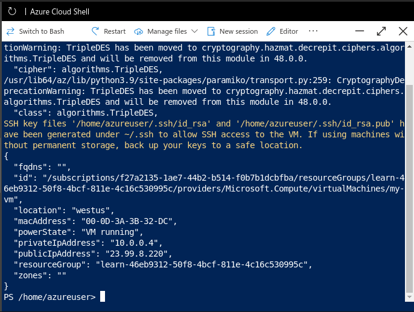
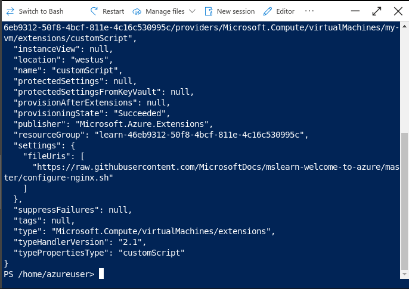
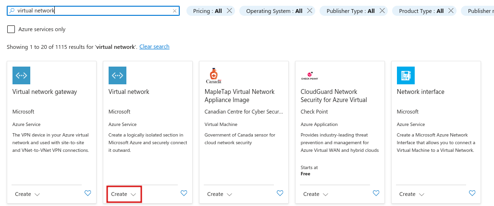
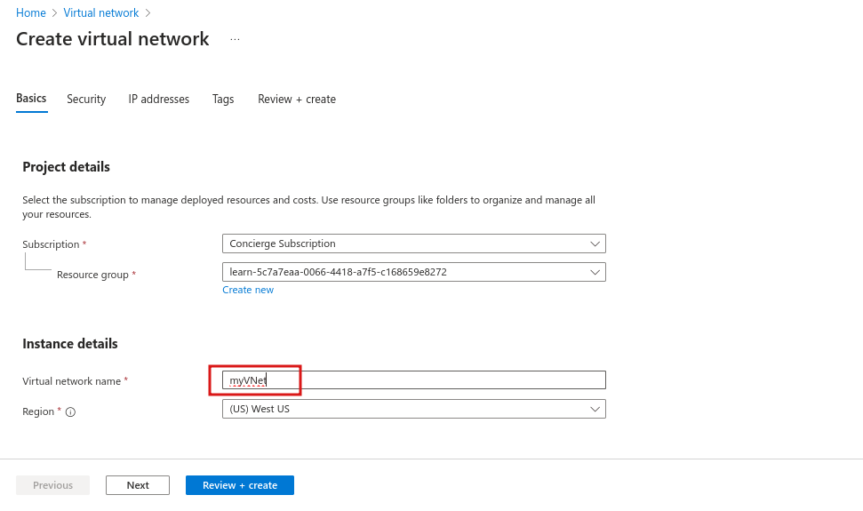
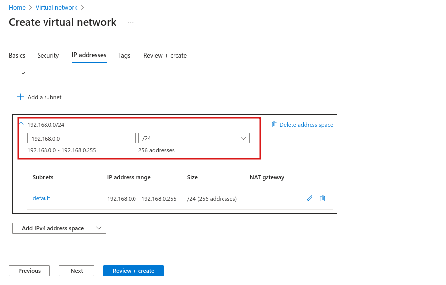
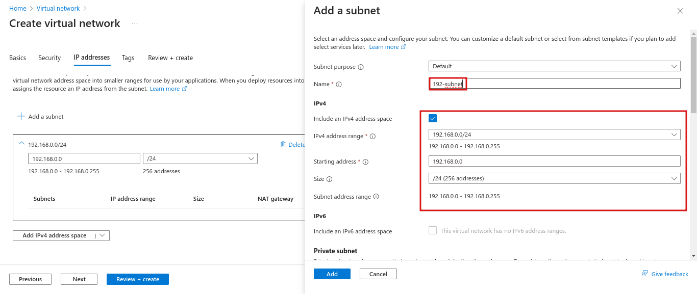
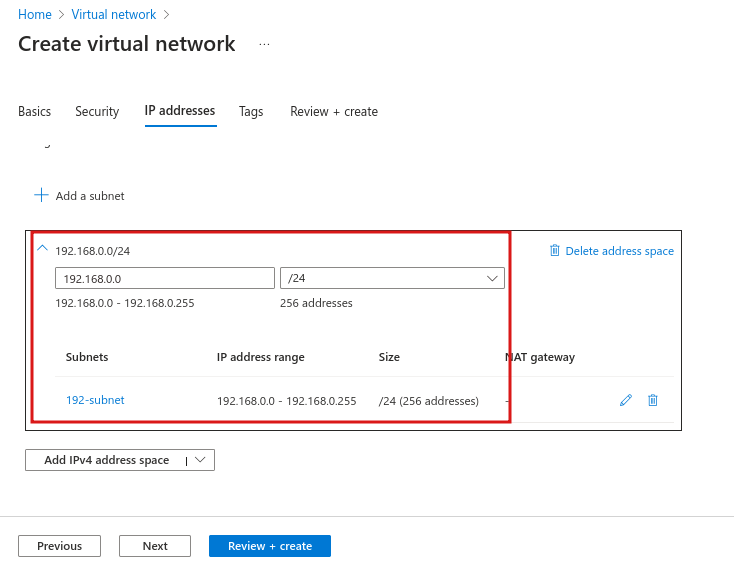

# شرح Azure Virtual Machines (VMs)

ال Azure Virtual Machines (VMs) هي خدمة من خدمات Microsoft Azure اللي بتخليك تقدر تستخدم سيرفرات افتراضية في السحابة (cloud). الخدمة دي بتقدم لك البنية التحتية كخدمة (IaaS) يعني بتقدر تشغل سيرفرات افتراضية من غير ما تضطر تشتري أو تحافظ على الهاردوير اللي بيشغل السيرفرات دي.

## إيه هي الـ Virtual Machines؟
- ال **Azure VMs** عبارة عن سيرفرات افتراضية، تقدر تستخدمها في السحابة.
- زي الكمبيوتر العادي بالظبط، تقدر تتحكم في كل حاجة شغالة على الـ VM.
- بتكون الاختيار المثالي لو محتاج:
  - **تحكم كامل في نظام التشغيل (OS).**
  - **تشغيل برامج مخصصة.**
  - **استخدام تكوينات استضافة مخصصة.**

الميزة هنا إنك مش مضطر تشتري أو تحافظ على الهاردوير، لكن برضه لازم تكون مسؤول عن صيانة النظام اللي شغال على الـ VM.

## إنشاء الـ VMs
- تقدر تستخدم صورة جاهزة (Image) علشان تبني الـ VMs بسرعة. الصورة دي بتكون template فيها نظام تشغيل وبرامج زي أدوات التطوير أو بيئات الاستضافة.
- تقدر تختار صورة معينة وتبدأ بناء الـ VM في دقائق.

## تكبير/تصغير عدد الـ VMs
- ممكن تستخدم **VMs واحدة** علشان تعمل اختبار أو تطوير أو لو عندك شغل بسيط.
- أو تقدر تجمع مجموعة من الـ VMs علشان تضمن **التوافر العالي**، **التوسع**، و **المرونة**.

### Virtual Machine Scale Sets
- ال **Virtual Machine Scale Sets** بتسمح لك تبني وتدير مجموعة من الـ VMs المتشابهة.
- الميزة هنا إن Azure بيدير لك كل حاجة زي:
  - **التوزيع على أكثر من سيرفر.**
  - **موازنة التحميل (Load Balancing).**
  - **التوسيع التلقائي (Auto-scaling)** بناءً على الاحتياج.

### Virtual Machine Availability Sets
- بتساعدك **Availability Sets** إنك تبني بيئة أكثر مرونة و **متاحة دائمًا**.
- بتقسم الـ VMs لحدود معينة عشان لو حصل مشكلة في جزء من الشبكة أو الكهرباء، الـ VMs التانية تفضل شغالة.

**كيفية تقسيم الـ VMs:**
- **Update Domain**: بتجمع الـ VMs اللي ممكن يتم تحديثهم مع بعض.
- **Fault Domain**: بتجمع الـ VMs اللي متوصلة لنفس مصدر الطاقة أو نفس الشبكة.

## أمثلة لاستخدام الـ VMs:
- **الاختبار والتطوير**: ممكن تنشئ أنواع مختلفة من الأنظمة أو التطبيقات بسرعة.
- **تشغيل التطبيقات في السحابة**: بدل ما تشتري جهاز مخصص، تقدر تشغل تطبيقاتك في السحابة وتوفر تكلفة.
- **تمديد مركز البيانات للسحابة**: تقدر تضيف VMs إلى شبكة افتراضية في Azure لتمديد الشبكة المحلية بتاعتك للسحابة.
- **الاسترداد بعد الكوارث**: لو حصل أي عطل في مركز البيانات، تقدر تنشئ VMs في السحابة وتشغل التطبيقات المهمة.

## مميزات الـ VMs:
- **سهل النقل**: لو عايز تنقل سيرفر مادي للسحابة، تقدر تنشئ صورة (Image) للسيرفر المادي وتستضيفها في VM.
- **مسؤولية الصيانة**: زي السيرفر العادي، انت المسؤول عن تحديث وصيانة الـ OS والبرامج.

## الموارد المطلوبة عند إنشاء الـ VM:
- **حجم الـ VM**: بتحدد الغرض وعدد الأنوية والذاكرة (RAM).
- **أقراص التخزين**: زي الهارد ديسك أو الأقراص الصلبة SSD.
- **الشبكات**: تحديد الشبكة الافتراضية، العنوان العام (IP)، وتكوين المنافذ.

---

# تطبيق عملي: Create an Azure virtual machine

هنعمل VM وهننزل عليها nginx الويب سيرفر المشهور. بس مش هنستخدم ال Portal ولكن هنستخدم ال CLI.

علشان نعمل vm هنكتب الامر بالشكل التالي:

```shell
az vm create --resource-group "learn-46eb9312-50f8-4bcf-811e-4c16c530995c" --name my-vm --public-ip-sku Standard --image Ubuntu2204 --admin-username azureuser --generate-ssh-keys
```

الامر دا هيعمل vm بإسم my-vm وهيحط فيها ubuntu واسم الادمن فيها azureuser ودا ال output بتاع الامر:


ثم هنضيف nginx لل VM بالشكل التالي:

```shell
az vm extension set --resource-group "learn-46eb9312-50f8-4bcf-811e-4c16c530995c" --vm-name my-vm --name customScript --publisher Microsoft.Azure.Extensions --version 2.1 --settings '{"fileUris":["https://raw.githubusercontent.com/MicrosoftDocs/mslearn-welcome-to-azure/master/configure-nginx.sh"]}' --protected-settings '{"commandToExecute": "./configure-nginx.sh"}'
```

الأمر ده بيستخدم **Custom Script Extension** علشان يشغل سكريبت Bash على الـ VM الخاص بك. السكريبت ده متخزن على GitHub. أثناء تشغيل الأمر، ممكن تفتح السكريبت في تاب منفصل في المتصفح علشان تراجع الكود.

ودا شكل ال output:



ودا اللي السكريبت بيعمله:

1. **تشغيل أمر apt-get update**:
   - بيحمل أحدث معلومات الحزم (packages) من الإنترنت.
   - الخطوة دي بتضمن إن الأوامر اللي جاية تقدر توصل لأحدث إصدار من الـ Nginx.

2. **تثبيت Nginx**:
   - بيقوم بتنزيل وتثبيت خادم الـ Nginx.

3. **إعداد الصفحة الرئيسية**:
   - بيعدل ملف الصفحة الرئيسية `/var/www/html/index.html`.
   - الصفحة دي بتعرض رسالة ترحيب (Welcome Message) بتتضمن اسم الـ VM (host name).

 ليه نستخدم الطريقة دي؟
- بتوفر وقت وجهد بدل ما تعمل الإعدادات يدويًا.
- تقدر تشغل السكريبت بسهولة لأي VM جديد بنفس الطريقة.

---

# شرح Azure Virtual Desktop 

ال **Azure Virtual Desktop** هو نوع تاني من الـ Virtual Machines، وهو عبارة عن خدمة لتشغيل سطح المكتب (Desktop) وتطبيقات بشكل افتراضي على السحابة (Cloud). الخدمة دي بتخليك تقدر تستخدم نسخة ويندوز مستضافة على السحابة من أي مكان. الخدمة شغالة على أجهزة وأنظمة تشغيل مختلفة، وكمان تقدر تدخل عليها من خلال تطبيقات بتسمح بالوصول للـ Remote Desktop أو من خلال أغلب المتصفحات الحديثة.

---

## مميزات Azure Virtual Desktop:

### 1. **تعزيز الأمان:**
- الخدمة بتوفر **إدارة أمن مركزي** لسطح المكتب باستخدام **Microsoft Entra ID**.
- تقدر تفعل **المصادقة متعددة العوامل (MFA)** علشان تحمي تسجيل دخول المستخدمين.
- التحكم في الوصول للبيانات بيتم عن طريق **أذونات التحكم بالوصول المبني على الأدوار role-based access controls (RBAC)**، بحيث كل مستخدم بياخد صلاحياته بدقة.
- البيانات والتطبيقات بتبقى مفصولة عن الأجهزة المحلية، وده معناه إن البيانات السرية مش هتفضل موجودة على الأجهزة الشخصية.
- جلسات المستخدمين (User Sessions) معزولة، سواء كنت شغال في بيئة Single Session أو Multi-Session.

### 2. **تشغيل Windows 10/11 متعدد الجلسات:**
- الخدمة بتسمح باستخدام **Windows 10 أو Windows 11 Enterprise Multi-Session**، واللي هو نظام تشغيل مبني على العميل (Client-Based OS) الوحيد اللي بيدعم وجود أكتر من مستخدم في نفس الوقت على نفس الـ VM.
- بيوفر تجربة أكتر ثباتًا ودعم أوسع للتطبيقات مقارنة بأنظمة التشغيل المبنية على Windows Server.

## ليه Azure Virtual Desktop مفيد؟
1. **الوصول من أي مكان:**  
   تقدر تفتح سطح المكتب أو التطبيقات الخاصة بيك من أي جهاز أو متصفح حديث.

2. **الأمان العالي:**  
   البيانات والتطبيقات بتفضل آمنة لأنها بتشتغل على السحابة ومش بتتحفظ على الأجهزة المحلية.

3. **الدعم للتطبيقات:**  
   الخدمة بتدعم تشغيل تطبيقات أكتر بشكل متناسق وثابت.

4. **توفير التكاليف:**  
   بدل ما تشتري أجهزة قوية لكل المستخدمين، تقدر تعتمد على الخدمة دي علشان تدير البيئات الافتراضية.

الخدمة مناسبة للشركات اللي عايزة توفر بيئة عمل مرنة وآمنة للموظفين، سواء كانوا شغالين من البيت أو المكاتب.

---

# شرح Azure Containers

الـ Containers بتمثل حل فعال وخفيف لإدارة التطبيقات بشكل افتراضي مقارنة باستخدام Virtual Machines. لو عندك تطبيقات متعددة عايز تشغلها على نفس الجهاز، الـ Containers بتوفر طريقة أسهل وأسرع من الـ VMs التقليدية.

## يعني إيه Containers؟
- الـ Containers هي بيئة افتراضية خفيفة (Lightweight Virtualization Environment).
- عكس الـ VMs، انت مش بتدير نظام تشغيل كامل في الـ Container. 
- بتقدر تشغل أكتر من Container على نفس الجهاز (سواء كان جهاز فيزيائي أو افتراضي).
- الـ Containers مصممة علشان تكون خفيفة وسهلة التوسع (Scaling) والتوقف (Stop) بشكل ديناميكي.
- لو حصل Crash أو مشكلة في الهاردوير، ممكن تعيد تشغيل الـ Container بسرعة.
- واحدة من أشهر الـ Container Engines هي **Docker**، وAzure بتدعم Docker بشكل كامل.

## الفرق بين Virtual Machines والـ Containers:
- الـ Virtual Machines بتشغّل نظام تشغيل كامل لكل VM.
- الـ Containers أخف وأسرع لأنك مش بتشغّل نظام تشغيل كامل لكل واحد.
- الـ VMs بتحتاج موارد أكتر للتشغيل، بينما الـ Containers بتستهلك موارد أقل وبتقدر تستجيب للتغييرات بسرعة.

## خدمات Azure المرتبطة بـ Containers:

### 1. **Azure Container Instances (ACI):**
- أسهل وأسرع طريقة لتشغيل Container في Azure.
- بتسمحلك ترفع الـ Containers بتاعتك، والخدمة بتدير تشغيلها ليك.
- **نوع الخدمة:** Platform as a Service (PaaS).  
- مش محتاج تدير أي Virtual Machines أو تستخدم خدمات إضافية.


### 2. **Azure Container Apps:**
- شبيهة بالـ Container Instances بس فيها مميزات إضافية:
  - تقدر تضيف **Load Balancing** لتوزيع الضغط.
  - بتسمحلك بتصميم أكتر مرونة (Elastic Design).
- برضه PaaS، يعني مش محتاج تدير الـ Container Management بنفسك.

### 3. **Azure Kubernetes Service (AKS):**
- خدمة لإدارة الـ Containers بشكل كامل (Container Orchestration).
- بتبسط إدارة أسطول من الـ Containers لما يكون عندك مجموعة كبيرة بتشتغل مع بعضها.
- بتمكنك من إدارة دورة حياة الـ Containers بشكل أكفأ.

## استخدامات الـ Containers في الحلول:
- بتُستخدم غالبًا في تطبيقات بتعتمد على **معمارية Microservices**.
  - بتقسم الحلول لمكونات أصغر ومستقلة.
  - مثال: ممكن تقسّم موقع ويب لعدة Containers:
    1. Container للـ Front-End.
    2. Container للـ Back-End.
    3. Container للتخزين (Storage).

- المميزات:
  - لو الـ Back-End وصل لحد السعة، ممكن توسّعه لوحده من غير تأثير على الـ Front-End أو الـ Storage.
  - لو احتجت تغير مكون معين (زي التخزين أو الواجهة الأمامية)، التغييرات دي ممكن تحصل بشكل مستقل بدون تأثير على باقي المكونات.

## ليه تختار Containers؟
1. **أسرع وأخف من الـ VMs.**
2. **مرونة عالية في التوسع والتصميم.**
3. **إدارة أبسط للتطبيقات المعقدة.**
4. **تكامل مع Azure Tools زي Docker وKubernetes.**

باختصار، الـ Containers بتوفرلك طريقة مرنة، سريعة، وخفيفة لإدارة التطبيقات وتوزيعها على السحابة.

---

# شرح Azure Functions

ال Azure Functions بتقدم طريقة لتشغيل الكود بتاعك بشكل **Serverless** من غير ما تحتاج تدير Virtual Machines أو Containers. لو بتستخدم VMs أو Containers عشان تشغل تطبيقك، الموارد دي لازم تكون شغالة طول الوقت. إنما مع Azure Functions، الكود بيشتغل لما يحصل حدث معين (Event) وبالتالي مش محتاج تبقي الموارد مخصصة باستمرار.


## **يعني إيه Serverless Computing في Azure؟**
- ال Serverless يعني إنك بتركّز على الكود بس من غير ما تدير البنية التحتية (Infrastructure).
- الكود بيتفعّل (Trigger) لما يحصل حدث معين زي:
  - طلب HTTP (REST Request).
  - Timer معين.
  - رسالة من خدمة تانية في Azure.


## **مميزات Azure Functions:**
1. **تركيز على الكود فقط:**
   - أنت مش محتاج تقلق من إدارة السيرفرات أو الشبكات. كل اللي يهمك هو الكود اللي هيشتغل.

2. **توسّع تلقائي (Automatic Scaling):**
   - الكود بيتوسع بناءً على الطلب. لو الطلب زاد، الخدمة بتتوسع تلقائيًا. ولو الطلب قل، الموارد بتقل علشان توفر تكاليف.

3. **الدفع مقابل الاستخدام:**
   - بتدفع بس على وقت تشغيل الكود (CPU Time) أثناء تنفيذ الـ Function. لما الكود يخلص، الموارد بتتلغي تلقائيًا.

4. **وظائف Stateless وStateful:**
   - **Stateless (الافتراضي):**
     - كل مرة الوظيفة بتشتغل كأنها بتبدأ من الصفر.
   - **Stateful (Durable Functions):**
     - بتحتفظ بسياق (Context) الوظيفة علشان تتبع النشاط السابق.

5. **مرونة في التوسع أو التغيير:**
   - لو احتياجات التطبيق بتاعك تغيّرت، ممكن تشغل الـ Functions في بيئة مش Serverless، وتديرها بنفسك باستخدام Virtual Networks أو حتى تعزلها تمامًا.


## **أمثلة على استخدام Azure Functions:**
1. تشغيل كود لما يوصل طلب HTTP.
2. تنفيذ مهمة معينة على مواعيد محددة (Scheduled Tasks).
3. معالجة رسائل أو بيانات من خدمات تانية زي Azure Event Grid أو Azure Queue.

## **إمتى تستخدم Azure Functions؟**
- لما تحتاج وظيفة تتنفذ بسرعة (خلال ثواني أو أقل).
- لو التطبيق بتاعك عليه طلب متغير (Variable Demand).
- لو عايز توفر في تكلفة التشغيل ومش عايز تدير الموارد يدويًا.

### ملحوظة:
ال Azure Functions مش بس Serverless، لكن كمان ممكن تشتغل كمنصة عامة لتشغيل أي نوع من الكود. لو احتجت إدارة الموارد بنفسك، بتقدر تغير البيئة بحيث تناسب احتياجاتك.


---

# شرح خيارات استضافة التطبيقات على Azure application hosting options

لو محتاج تستضيف تطبيقك على Azure، عندك أكتر من خيار زي **Virtual Machines (VMs)** أو **Containers**. لكن بجانبهم، في خدمات تانية زي **Azure App Service** اللي بتقدم حلول قوية لاستضافة التطبيقات من غير ما تشيل هم إدارة البنية التحتية.


## **Azure App Service**
ال Azure App Service بتتيحلك:
- إنشاء واستضافة **تطبيقات ويب**، **وظائف خلفية (Background Jobs)**، **Back-ends للموبايل**، و**APIs RESTful** بأي لغة برمجة.
- إدارة البنية التحتية أوتوماتيكيًا مع **توسّع تلقائي** و**توافر عالي**.
- دعم بيئات **Windows** و**Linux**.
- تكامل مع أدوات زي GitHub وAzure DevOps لتفعيل نموذج **Continuous Deployment**.

### **المزايا الرئيسية:**
1. **سهولة التركيز على التطبيق فقط:**
   - ال Azure بتتولى إدارة البيئة بدل ما تضيع وقتك على إدارة السيرفرات.
2. **دعم لغات برمجة متعددة:**
   - زي .NET، Java، Ruby، Node.js، PHP، Python.
3. **حماية وتأمين:**
   - المنصة بتوفر أدوات لتأمين نقاط النهاية.
4. **مرونة التوسع:**
   - التطبيق بيتوسع تلقائيًا عشان يتعامل مع حركة المرور العالية.
5. **تحمّل عالي (High Availability):**
   - مع وجود Load Balancer مدمج وإدارة حركة المرور.


## **أنواع الخدمات في Azure App Service:**
### **1. Web Apps**
- استضافة تطبيقات ويب باستخدام لغات زي:
  - ASP.NET، Java، Ruby، PHP، Python.
- تقدر تختار نظام التشغيل بين Windows أو Linux.


### **2. API Apps**
- بناء واستضافة APIs REST باستخدام أي لغة برمجة.
- دعم كامل لـ **Swagger** للنشر في Azure Marketplace.
- APIs دي بتتفاعل مع أي عميل بيستخدم HTTP أو HTTPS.


### **3. WebJobs**
- لتشغيل برامج أو سكريبتات زي:
  - ملفات تنفيذية (.exe)، سكريبتات (.cmd, .bat, PowerShell, Bash).
- ممكن تعملها جدول زمني أو تشغيلها عند حدوث **Trigger** معين.
- ال WebJobs غالبًا بتُستخدم لتشغيل **مهام خلفية** كجزء من التطبيق.


### **4. Mobile Apps**
- إنشاء Back-end سريع لتطبيقات الموبايل (iOS وAndroid) باستخدام:
  - تخزين بيانات التطبيق في **SQL Database** على السحابة.
  - توثيق المستخدمين ضد خدمات زي Google وFacebook.
  - إرسال **Push Notifications**.
  - تشغيل منطق الخلفية بالكود باستخدام C# أو Node.js.
- دعم **SDKs** لتطبيقات Native iOS وAndroid وXamarin وReact Native.


## **الخلاصة:**
ال Azure App Service بتوفر حل شامل لاستضافة تطبيقاتك سواء كانت ويب، APIs، أو تطبيقات موبايل. الميزة الكبيرة إنها بتريحك من إدارة البنية التحتية وبتتيحلك تركز على تطوير وتحسين التطبيق نفسه.

---

# شرح الشبكات الافتراضية في Azure virtual networking

**الشبكات الافتراضية في Azure** بتتيح لك ربط الموارد المختلفة في Azure (زي الـ VMs، التطبيقات، وقواعد البيانات) مع بعضها البعض، ومع الإنترنت، ومع الأجهزة في الشبكة المحلية (On-premises). الشبكة الافتراضية في Azure بتعمل كأنها تمدد لشبكتك المحلية، بحيث تقدر توصل الموارد مع بعضها داخل Azure ومع الأجهزة الموجودة عندك في الشبكة المحلية.


## **الخصائص الرئيسية للشبكات الافتراضية في Azure:**
1. **العزل والتقسيم** - Isolation and segmentation:
   - تقدر تعمل شبكات افتراضية معزولة (Virtual Networks) وتحدد مساحة عناوين IP خاصة بيك، وتقدر تقسّمها لعدة **Subnets**.
   - العناوين دي مش قابلة للوصول من الإنترنت.

2. **الاتصالات بالإنترنت** - Internet communications:
   - تقدر توصل لأجهزة Azure من الإنترنت من خلال تخصيص **IP عام** للموارد أو وضعها خلف **Load Balancer عام**.

3. **التواصل بين موارد Azure**:
   - الشبكات الافتراضية بتربط بين الـ **VMs** وموارد تانية زي:
     - **App Service Environment**.
     - **Azure Kubernetes Service**.
     - **Azure VM Scale Sets**.
   - **Service Endpoints** بتربط الموارد زي Azure SQL وStorage Accounts بشبكتك الافتراضية لتحسين الأمان وتحقيق توجيه مثالي.

4. **التواصل مع الموارد المحلية (On-premises)**:
   - تقدر تعمل شبكة تمتد بين Azure والبيئة المحلية عن طريق 3 آليات:
     - **Point-to-site VPN**: اتصال مشفر من جهاز كمبيوتر خارجي إلى الشبكة المحلية عبر VPN.
     - **Site-to-site VPN**: ربط جهاز VPN المحلي بجهاز VPN في Azure.
     - **Azure ExpressRoute**: اتصال خاص وآمن مباشرة مع Azure بدون المرور على الإنترنت، مع توفير سرعة أعلى وأمان أكبر.

5. **توجيه حركة الشبكة (Routing)**:
   - Azure بيقوم بتوجيه حركة المرور بين الـ **Subnets** والـ **Virtual Networks** المحلية والموجودة على الإنترنت بشكل افتراضي.
   - تقدر تتحكم في التوجيه عن طريق **Route Tables** و **BGP**.

6. **فلترة حركة الشبكة (Network Traffic Filtering)**:
   - تقدر تحكم في مرور البيانات بين الـ **Subnets** باستخدام:
     - **Network Security Groups (NSGs)**: بتحدد قواعد لمنع أو السماح بالحركة بناءً على عوامل زي العنوان أو المنفذ أو البروتوكول.
     - **Network Virtual Appliances**: أجهزة افتراضية تؤدي وظائف معينة في الشبكة مثل الجدران النارية أو تحسين الشبكات.

7. **ربط الشبكات الافتراضية (Virtual Network Peering)**:
   - تقدر توصل بين شبكتين افتراضيتين في Azure باستخدام **Virtual Network Peering**.
   - الشبكة بين الشبكتين بتبقى خاصة، وتتم عبر **شبكة Microsoft الخلفية** بدون المرور على الإنترنت العام.
   - ال **User-defined Routes (UDR)** بتسمحلك بالتحكم في جداول التوجيه بين الـ Subnets أو بين الشبكات الافتراضية.

## **الخلاصة:**
الشبكات الافتراضية في Azure بتوفر مجموعة من الأدوات لربط وتأمين وتوجيه البيانات بين الموارد في Azure وبين البيئة المحلية، سواء كنت عايز توصل بيانات داخل Azure أو مع الأجهزة في شبكتك المحلية، أو حتى توفر حلول لتوسيع شبكتك بين مناطق مختلفة.

---

# تطبيق عملي علي Virtual Networking

اول حاجة هنعمل virtual network ثم هنقوم 2VMs ونحاول نضيفهم في نفس ال subnet ثم نعمل ping علي كل واحد فيهم!

## Create a Virtual Network & a Subnet




هنا سمينا ال Virtual Network بإسم myVNet



هنا بقا عملنا IPv4 address space وحطيناها 192.168.0.0/24 هنضيف بقا ال subnet من خلال ال button بتاع Add a subnet




ودا الشكل بعد م تضيف ال subnet



هندوس review + create ثم ننتظر عملية ال create.


## Create 2 new VMs

هنبدأ نضيف 2VMs:


بعد كدا هندوس علي review + create

هنعمل VM تانية بنفس الخطوات!

ودا بعد م عملنا SSH Connection:


وبكدا قدرنا نعمل 2VMs ونربطهم ببعض علي نفس ال subnet!

# شرح ال Network Security Group (NSG)

خلينا نقول ال NSG دا عامل زي ال filter بتاع ال traffic اي اللي يعدي واي اللي ميعديش مين يقدر ي connect علي ال vm دي أو مين لا.

**مثال:**
- إذا كان لديك **VM في Azure، يمكنك تطبيق NSG عليه للسماح بالوصول فقط عبر الـ **HTTP (منفذ 80)**، مع حظر أي حركة مرور أخرى.
- او لو كان عندك port معين مش عاوز غير IPs معينة هي اللي تقدر تتواصل معاها هنا بتستخدم ال NSG برضو.

**مكونات NSG:**

- **قواعد الأمان (Security Rules):**
    - **Inbound Rules**: تتحكم في حركة المرور الواردة إلى الموارد.
    - **Outbound Rules**: تتحكم في حركة المرور الصادرة من الموارد.
- **معايير القواعد:**
    - **Source IP**: عنوان الـ IP المصدر.
    - **Destination IP**: عنوان الـ IP الهدف.
    - **Port**: المنفذ (مثل HTTP الذي يستخدم المنفذ 80).
    - **Protocol**: البروتوكول (مثل TCP أو UDP).
    - **Action**: السماح أو الحظر.


نسيبنا من الكلام النظري ونطبق عملي:

# تطبيق عملي علي ال NSG

اولا هنعمل VM جديدة ودي عرفنا بتتعمل ازاي فنتخطي الحتة دي وهنخش علي ال NSG!


هنروح علي ال Network Settings tab الخاصة بال VM وهننزل تحت خالص لغاية م نوصل لل network security group. لو أخدت بالك هتلاقيني مشغل 2 ports وهم ال HTTP and SSH لو جيت تجرب تعمل RDP connection مش هتقدر ﻷن البورت 3389 مش مفعل!

طب حابب افعل ال RDP ويقبل ال IP بتاعي بس (يعني مش اي حد من برا يقدر يعمل RDP connection علي ال VM) هنعملها بالشكل التالي:

1. هتدوس علي Create port rule المشار ليها برقم 2 ثم هتختار inbound port rule
ثم:


هنختار خيار ال My IP Address  وهيختار ال IP بتاعنا فقط (اللي مغطيه باللون الاحمر) ثم هتختار الخدمة وهتكون ال RDP ثم ندوس Add وبعد الاضافة المفروض تكون بالشكل التالي:


واسمها AllowMyIPAddressRDPInbound واللي متغطي باللون الاحمر دا ال IP الخاص بي.

هتيجي تعمل RDP Connection هيشتغل عادي 😄

---

هنأجل شرح ال VPN وتفاصيله في ال AZ-104 إن شاء الله